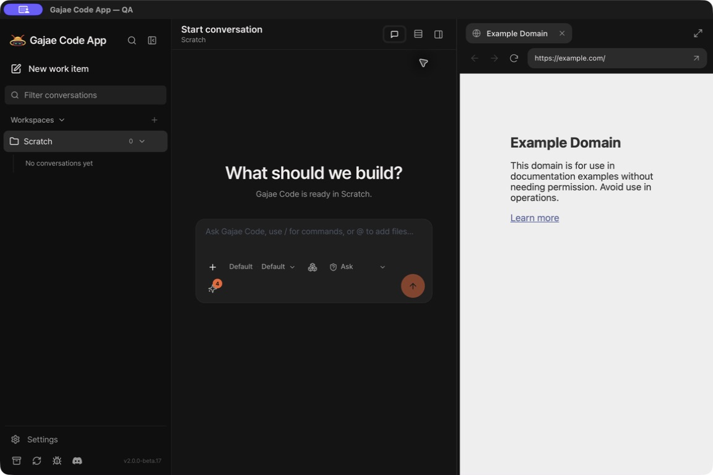
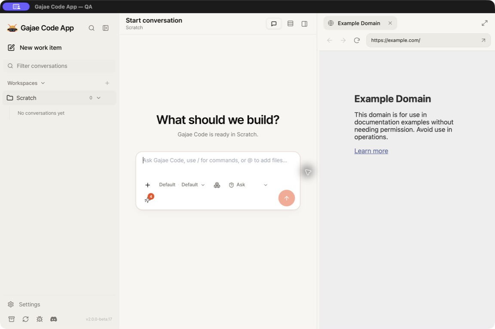

# Built-in browser contract

The built-in browser replaces the app-managed Chromium sidecar for basic browser
automation. It is available only in the macOS desktop app. Web and self-hosted
clients hand web links to the external browser.

## Choice and availability

The application choice is `builtin`, `aside`, or `ego` (default `builtin`). A
stored legacy `native` value reads as `builtin`; new writes use only the new
names. Built-in explicitly selects the runtime's native browser setting on each
run. Aside and ego keep their CLI probes, routing and no-fallback failure
behavior.

Rust reports actual built-in availability through authenticated automation
status. If capability is absent, the app removes both its browser custom tool
and the SDK browser tool name, so ordinary chat remains usable and a browser
direct browser API request receives an explicit unsupported result instead of
activating the SDK's Chromium implementation. Hidden tool discovery is also
disabled under the app's existing tool allowlist policy.

## Separate manual and chat-link surfaces

Settings has an explicit **Open browser** action for the app's built-in browser
panel. It is independent of the selected GJC backend: the selected session
owns the panel, or the selected project's `project-<projectId>` scope is used
when no session is selected. Changing the agent backend therefore does not
redirect this manual action.

Absolute HTTP(S) links in chat Markdown always go to the user's external
browser. They never open the built-in panel merely because the Tauri bridge is
present, and they do not follow the selected agent backend. In the desktop app
the server hands these links to the operating system opener; in a regular web
browser they use a new browser tab.

## Surface and ownership

One browser panel on the right of the main app window has one owner. An
attempt by another session while it remains open fails as
`builtin_browser_in_use`; closing the panel releases ownership. The app reflows
into the space to its left. Drag the vertical divider, or focus it and use the
arrow keys, to adjust the width. Closing the panel restores the full app area;
it never closes the main window. At narrower sizes the app uses its existing
responsive navigation. The expand button temporarily gives the browser the full
window, preserving the hidden app viewport; restore returns to the same split
width and draft. Closing an expanded browser also restores the app.

The 92-point chrome has a page-title row and a separate navigation/address row,
with SVG icons, a focusable rounded address field, loading feedback and inline
errors. Page titles are rendered as text. The local toolbar alone can read a
bounded snapshot of the app's computed semantic colors, font family and UI
language; it follows `src/index.css` and the selected theme instead of keeping a
second palette. The snapshot refreshes while the panel is visible. Expansion
and appearance remain presentation data on the toolbar channel, outside the
agent browser state/command protocol.

The trusted toolbar/divider (`builtin-controls`) and the unprivileged remote
page (`builtin-page`) are native sibling WebViews in `main`, using Tauri 2.11.5
with its exact-pinned `unstable` feature. AppKit content-layout coordinates keep
the panel below the titlebar through live resize. Capabilities target individual
WebView labels, never the containing `main` window, so the remote page cannot
inherit app privileges. The original main window/view handle is retained before
adding children: Tauri's single-WebView lookup intentionally stops matching a
window with siblings, while deep links, recovery, Dock reopen and updater
messages still need the original app view.

The supported actions are open/close, navigate, back, forward, reload, observe,
extract, selector-based click and fill. Arbitrary page `run`, screenshots,
frame streaming, input forwarding and multiple tabs are intentionally absent.
Each command carries the expected window/document/origin captured before any
permission prompt, preventing approval from authorizing a later navigation.
An isolated WKContentWorld holds a private per-document identity. The native
state remains loading until that identity is installed in the finished page;
even a reload at the same URL invalidates earlier document authority. DOM
actions verify this identity immediately before accessing the page. Observed
selectors are unique, ambiguous click/fill requests are rejected, and text/HTML
previews are bounded in UTF-8 with explicit truncation metadata.

Navigation permits HTTPS and exact loopback HTTP only. It rejects the app's own
server origin, credentials and special schemes. macOS 13 uses an explicit
ephemeral profile; macOS 14+ uses a persistent UUID profile.

## Boundary and lifecycle

The worker reaches `AutomationService` through the existing bridge. The server
then verifies the native endpoint's HMAC proof; native separately checks the
server's kernel `LOCAL_PEERPID`. Desktop bootstrap uses one private stdin
`GJC_DESKTOP_INIT` v2 envelope, with an optional updater binding. A retained open
panel blocks restart preparation. Owner and pending work are retired only
after both child WebViews have closed and native detachment is confirmed on the
main thread. Failed teardown retains ownership and the restart blocker.
Fences, cancellation and physical pending work remain owned until confirmed
settled.

## Packaging and acceptance

Root Puppeteer dependencies are removed, but the pinned SDK still brings
`puppeteer-core` and `@puppeteer/browsers`. Keep the extract-zip backport,
runtime manifest checks and payload security graph until that dependency graph
changes; this contract does not claim that packaged Puppeteer bytes are gone.

## Browser chrome refinement — 2026-09-14

The provided Codex browser reference informed the title pill, separate rounded
address row, restrained borders and matching line icons. The supported controls
now include native expand/restore in addition to the original browser actions.

- `npm run verify` passed. The final native suite passed 381 tests (6 existing
  opt-in cases ignored), plus 11 build-binding tests. Ten toolbar DOM tests cover
  title-as-text handling, retained SVGs, loading state, app appearance, address
  editing, expand/restore and divider input.
- The ad-hoc macOS app built successfully using the existing verified server
  payload. Seventeen authenticated REST/native checks passed, including denial
  of remote access to the new appearance reader and the unchanged agent state
  shape.
- GUI QA confirmed matching light/dark chrome, expansion and restoration with
  the original split width and draft, closing while expanded, and the final
  copied app opening the redesigned panel outside the checkout.

## Docked panel validation — 2026-09-14

Checked on macOS 26.6.2 / Apple Silicon with an isolated `--qa-profile`:

- `npm run verify` passed. The final native suite passed 380 tests (6 existing
  opt-in cases ignored), plus 11 build-binding tests. Geometry coverage checks
  both AppKit coordinate systems, minimum widths and transient small sizes;
  toolbar DOM tests cover keyboard resizing, drag coalescing and cancellation.
- The macOS payload and its out-of-tree smoke passed. An ad-hoc app with
  `GJC_UPDATE_MODE=disabled` built successfully. The final app was copied outside
  the repository and launched by its canonical path, retaining Tauri's macOS
  symlink rejection. Updated Settings text and native panel opening passed in
  this copied app.
- 15 authenticated REST → native checks passed: close/reopen, profile mode,
  owner collision, denial of page attempts to call both app and toolbar IPC,
  observation, fill, click, extraction, navigation, stale binding rejection,
  back/forward, reload invalidation and confirmed native close.
- GUI checks passed for Settings launch, a single main window with conversation
  and browser side by side, mouse/keyboard divider resizing, main-window resize,
  address navigation, direct page input/click, and panel close restoring the full
  conversation width without losing its unsent draft. Quit with an open panel
  settled, and the draft survived the copied-app restart.

This is local source and ad-hoc acceptance, not a signed production release or
an installation over the user's existing app.

## Validation — 2026-09-12

The integrated change was checked on **macOS 26.6.2, arm64**, using an isolated
`--qa-profile` and a disposable loopback website. No production profile or model
credentials were used.

- The full `npm run verify` gate passed, including the real SDK contract suites,
  browserless root/delegation discovery checks, origin permission binding,
  frontend DOM suites, locale parity and package checks. Final typecheck, lint
  and identity checks also passed after cleanup.
- The macOS server payload built and passed its out-of-tree smoke. The final
  native suite passed **358 tests** with 6 existing opt-in cases ignored; the
  build-binding integration suite passed **11 tests**. An ad-hoc app was built
  with `GJC_UPDATE_MODE=disabled`.
- **30 real authenticated REST → server → native WebView checks passed**:
  readiness, opening/loading, title, bounded long Korean-page observation,
  truncation, unique selectors, fill and its input event, click and its page
  handler, ambiguous-selector rejection, remote IPC denial, owner collision,
  navigation, stale-document rejection, native back/forward/reload, same-URL
  reload invalidation and fresh observation, all three loopback
  aliases for the forbidden app server, removed input endpoint, close and the
  confirmed empty state.
- Actual GUI checks passed for Settings launch, the full toolbar below the
  titlebar, address-field navigation, direct page typing/clicking, visible
  blocked-address feedback, toolbar close and normal QA app quit. Geometry
  uses AppKit's content layout and parent coordinate system; the toolbar and
  its status row fit inside 56 points without covering the page.

The native document, cancellation, retained-window restart fence, profile/QA
isolation and capability invariants also have focused Rust tests. A synthetic
updater exchange peer now stays alive until retirement, matching the real
persistent channel and avoiding an early-EOF race in that test fixture.

This is source/ad-hoc acceptance. It does not claim a new live-model browser
run, physical macOS 13 execution, or a signed/notarized production update.
